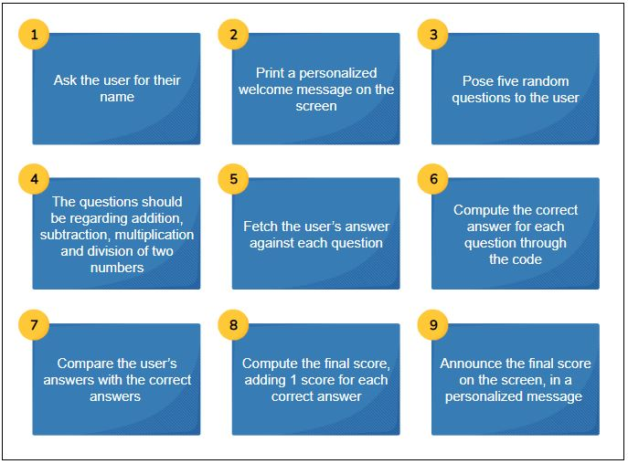

# MathQuiz

## Project Description
MathQuiz is an educational app designed to help elementary school students develop and improve their math skills. The app generates random math questions and checks the students' answers, providing immediate feedback to help them learn and grow.

## Project Requirements


## Installation
To install and run MathQuiz, follow these steps:
1. Clone the repository:
   ```
   git clone https://github.com/yourusername/MathQuiz.git
   ```
2. Navigate to the project directory:
   ```
   cd MathQuiz
   ```
3. Compile the project:
   ```
   javac -d bin src/*.java
   ```
4. Run the application:
   ```
   java -cp bin Main
   ```

## Usage
1. Launch the app.
2. Select the type of math questions you want to practice (addition, subtraction, multiplication, division).
3. Answer the questions as they appear on the screen.
4. Receive immediate feedback on your answers.
5. Track your progress over time to see how much you've improved.

## Contributing
We welcome contributions to MathQuiz! If you'd like to contribute, please follow these steps:
1. Fork the repository.
2. Create a new branch for your feature or bug fix:
   ```
   git checkout -b feature-name
   ```
3. Make your changes and commit them:
   ```
   git commit -m "Description of your changes"
   ```
4. Push your changes to your forked repository:
   ```
   git push origin feature-name
   ```
5. Create a pull request to merge your changes into the main repository.

## License
This project is licensed under the MIT License. See the [LICENSE](LICENSE) file for more details.

Happy learning!


